# Macmikase Architecture Guide

A comprehensive guide to how macmikase works, with visual diagrams explaining the system architecture and chezmoi's role.

## Table of Contents

1. [What is Chezmoi?](#what-is-chezmoi)
2. [System Overview](#system-overview)
3. [Component Architecture](#component-architecture)
4. [Installation Flow](#installation-flow)
5. [Theme System & Chezmoi Integration](#theme-system--chezmoi-integration)
6. [Theme Switching Flow](#theme-switching-flow)
7. [Data Flow Diagrams](#data-flow-diagrams)

---

## What is Chezmoi?

**Chezmoi** is a dotfile manager that helps you manage your configuration files (dotfiles) across multiple machines. It's designed to handle:

- **Templating**: Generate different configs for different machines/environments
- **Encryption**: Store secrets securely
- **Version control**: Keep dotfiles in git while managing per-machine differences
- **Idempotency**: Safely apply changes without overwriting local modifications

### Key Concepts

- **Source directory**: Where your dotfile templates live (in this project: `chezmoi/`)
- **Target directory**: Where chezmoi generates the final files (your home directory)
- **Data file**: Configuration that drives template generation (`~/.config/chezmoi/chezmoi.toml`)
- **Templates**: Files with `.tmpl` extension that get processed with variables

### How Chezmoi Works

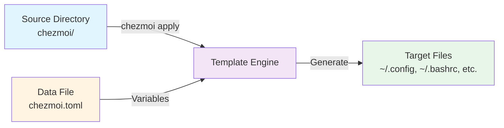

**Example**: A template file `chezmoi/dot_config/ghostty/config.tmpl` might contain:

```toml
config-file = {{ .themes_dir }}/{{ .theme }}/ghostty.conf
```

When chezmoi processes this with `theme = "nord"` and `themes_dir = "~/.local/share/macmikase/themes"`, it generates:

```toml
config-file = ~/.local/share/macmikase/themes/nord/ghostty.conf
```

---

## System Overview

Macmikase combines multiple tools to create a unified macOS configuration system:

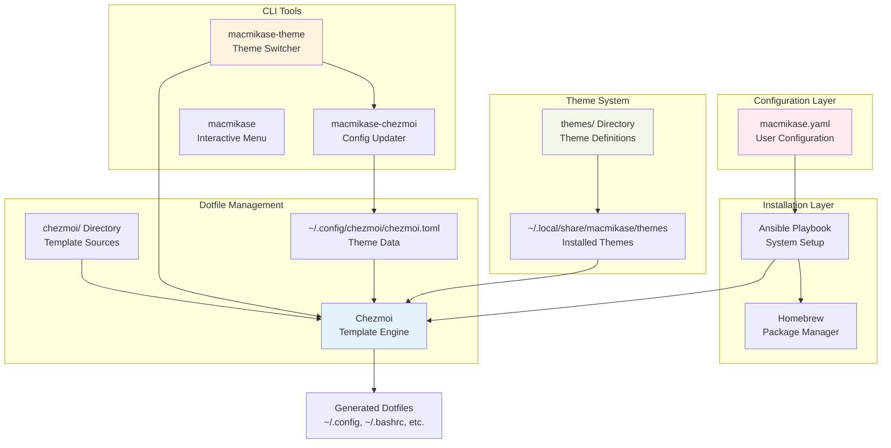

---

## Component Architecture

### High-Level Component Relationships

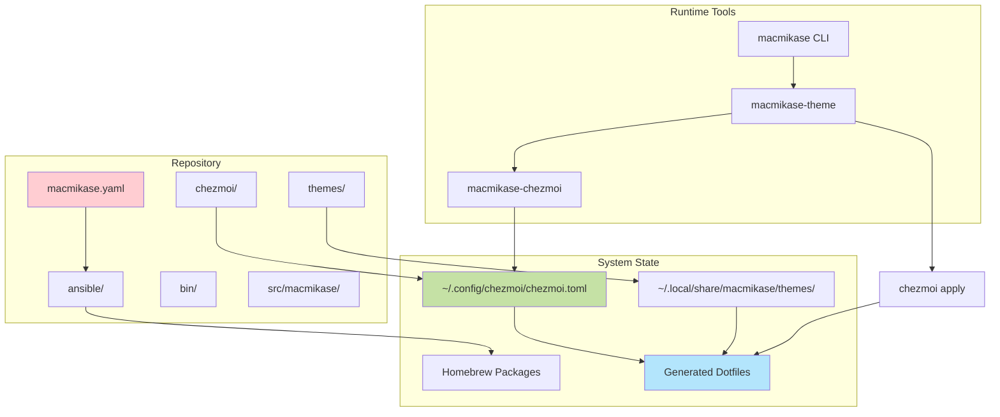

### Detailed Component Breakdown

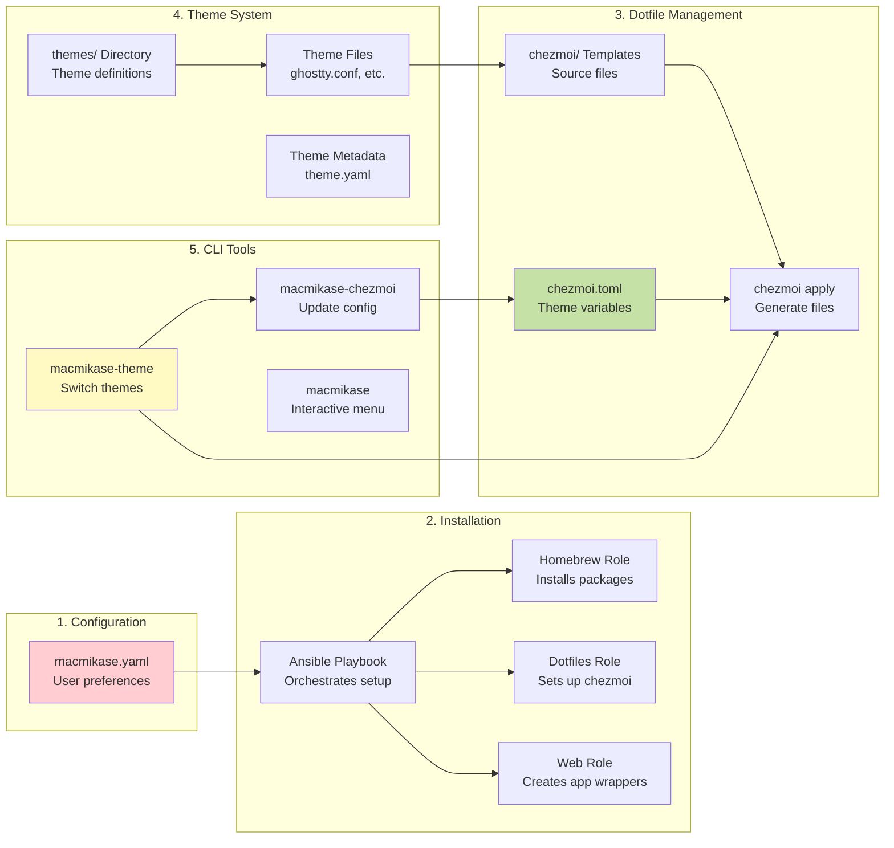

---

## Installation Flow

### Complete Installation Process

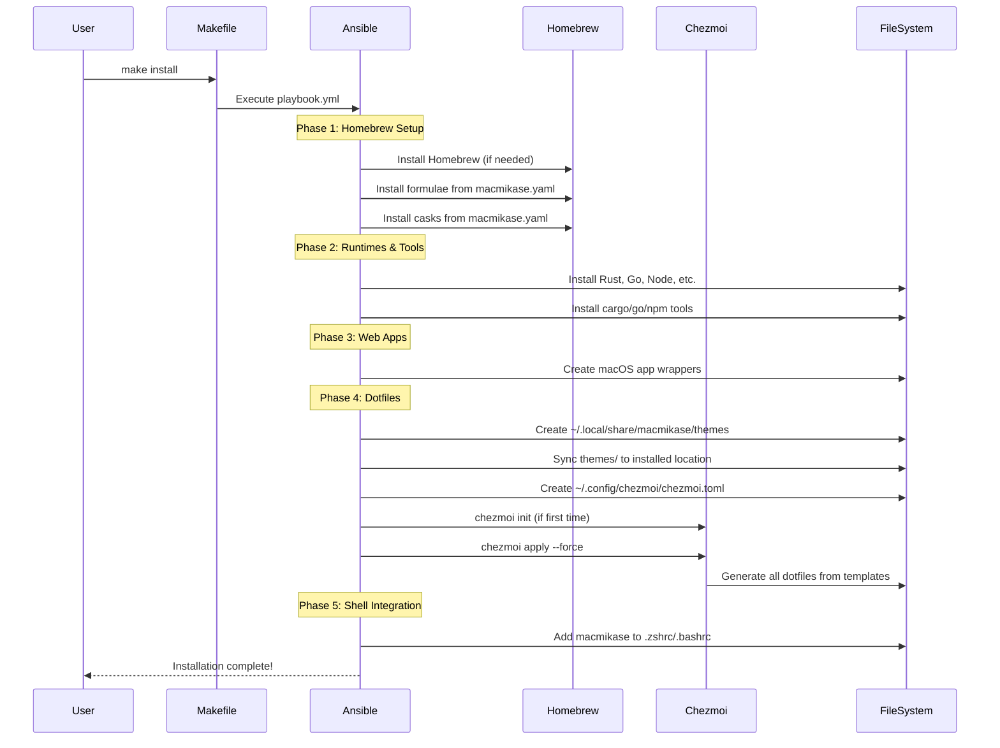

### Installation State Diagram

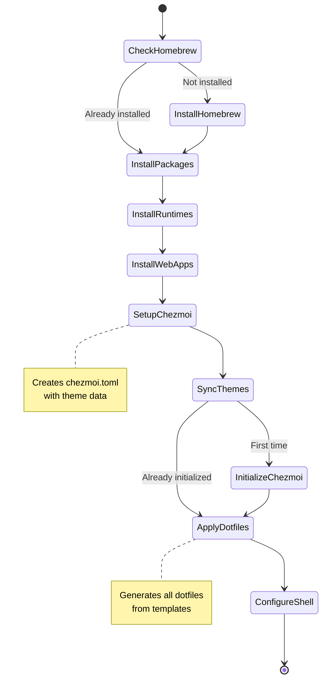

---

## Theme System & Chezmoi Integration

### How Themes Work with Chezmoi

The theme system is deeply integrated with chezmoi's templating system:

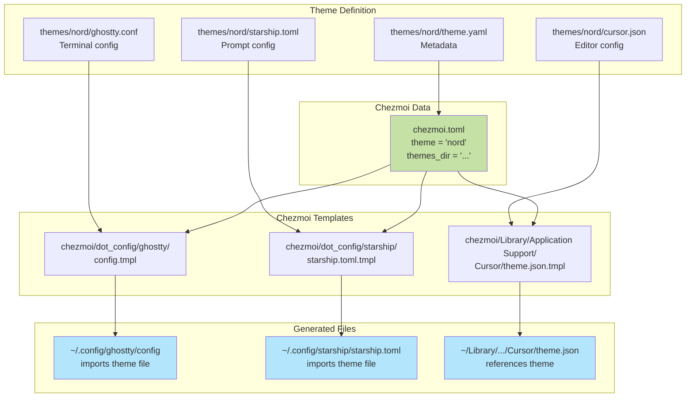

### Template Processing Example

Here's how a template gets processed:

**Template** (`chezmoi/dot_config/ghostty/config.tmpl`):
```toml
config-file = {{ .themes_dir }}/{{ .theme }}/ghostty.conf
```

**Data** (`~/.config/chezmoi/chezmoi.toml`):
```toml
[data]
theme = "nord"
themes_dir = "~/.local/share/macmikase/themes"
```

**Generated File** (`~/.config/ghostty/config`):
```toml
config-file = ~/.local/share/macmikase/themes/nord/ghostty.conf
```

### Theme File Structure

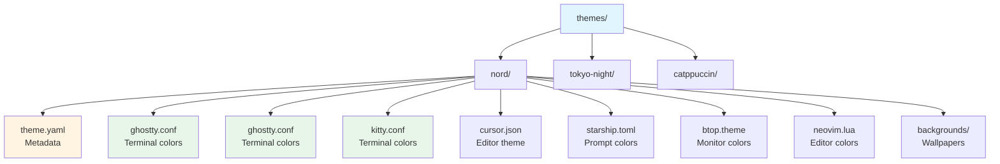

---

## Theme Switching Flow

### Complete Theme Switch Process

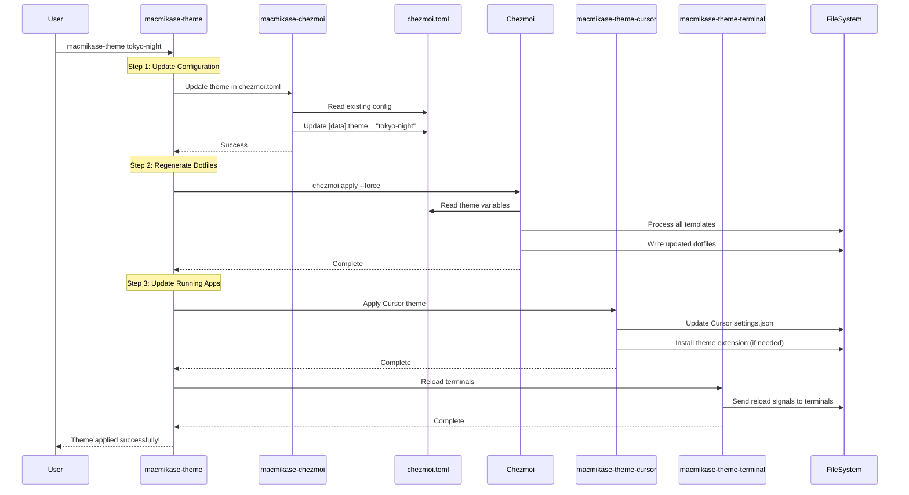

### Theme Switch State Diagram

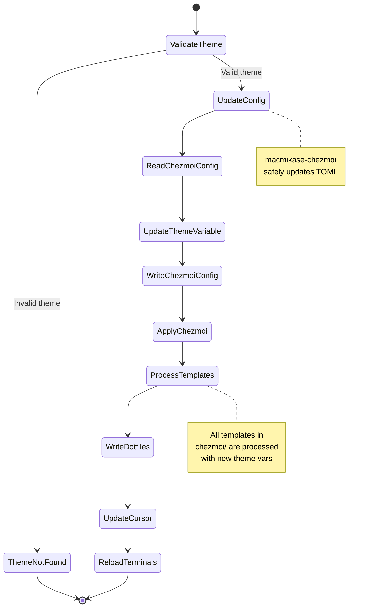

---

## Data Flow Diagrams

### Configuration Data Flow

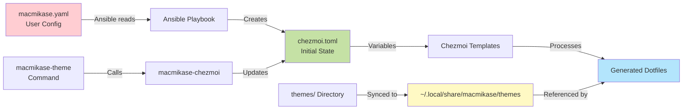

### Template Variable Resolution

```mermaid
graph TB
    A[chezmoi.toml<br/>[data] section] -->|Provides| B[Template Variables]
    
    B --> C[.theme]
    B --> D[.themes_dir]
    B --> E[.font_family]
    B --> F[.font_size]
    
    C --> G[Template Files]
    D --> G
    E --> G
    F --> G
    
    G --> H[ghostty/config.tmpl]
    G --> I[starship.toml.tmpl]
    G --> J[settings.json.tmpl]
    
    H --> K[Generated Files]
    I --> K
    J --> K
    
    style A fill:#c5e1a5
    style G fill:#e3f2fd
    style K fill:#e8f5e9
```

### File System Layout

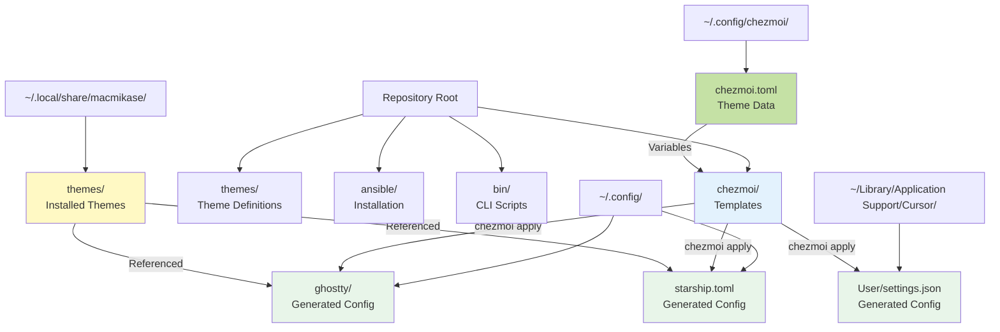

---

## Key Concepts Summary

### Chezmoi's Role

1. **Template Storage**: All dotfile templates live in `chezmoi/` directory
2. **Variable Injection**: `chezmoi.toml` provides theme and configuration variables
3. **File Generation**: Running `chezmoi apply` processes templates and generates actual config files
4. **Idempotency**: Safe to run multiple times; only updates changed files

### Theme System Integration

1. **Theme Definitions**: Each theme in `themes/` contains config files for various apps
2. **Theme Installation**: Themes are synced to `~/.local/share/macmikase/themes/` during installation
3. **Template References**: Chezmoi templates reference theme files using variables like `{{ .themes_dir }}/{{ .theme }}/ghostty.conf`
4. **Dynamic Switching**: Changing the theme variable in `chezmoi.toml` and running `chezmoi apply` updates all configs

### Why This Architecture?

- **Separation of Concerns**: Ansible handles system setup, chezmoi handles dotfiles
- **Flexibility**: Easy to add new themes or modify existing ones
- **Portability**: Templates work across different machines with different themes
- **Version Control**: All templates and themes are in git, but generated files are not
- **Safety**: Chezmoi can detect and preserve local modifications

---

## Common Workflows

### Adding a New Theme

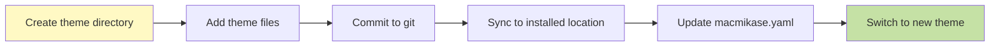

### Modifying a Dotfile Template

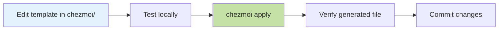

### Switching Themes

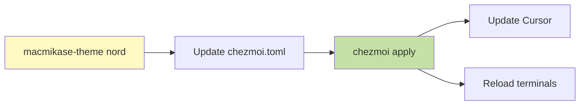

---

This architecture provides a robust, flexible system for managing macOS workstation configuration with a powerful theme system that integrates seamlessly with chezmoi's templating capabilities.
